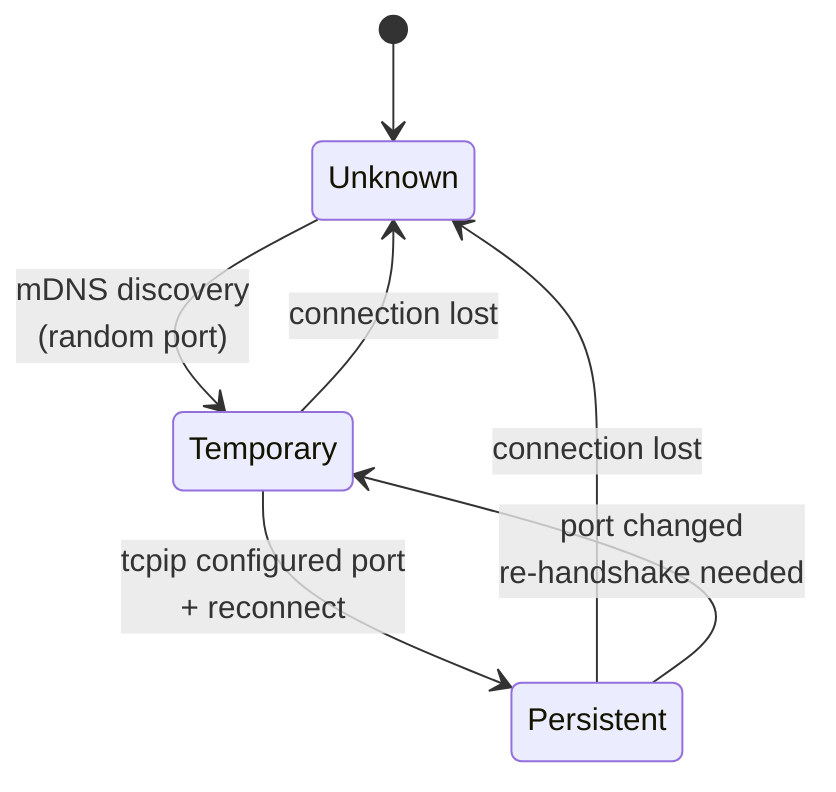
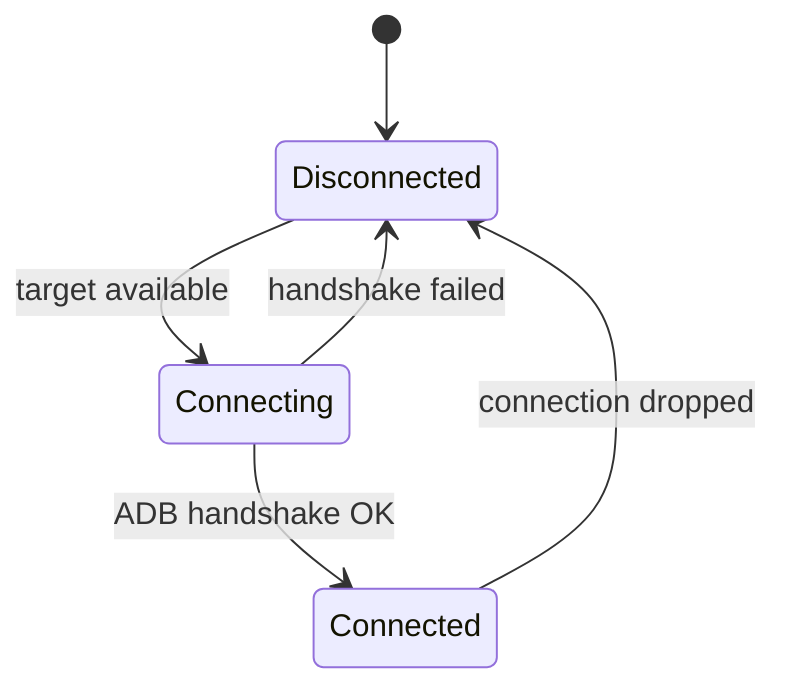
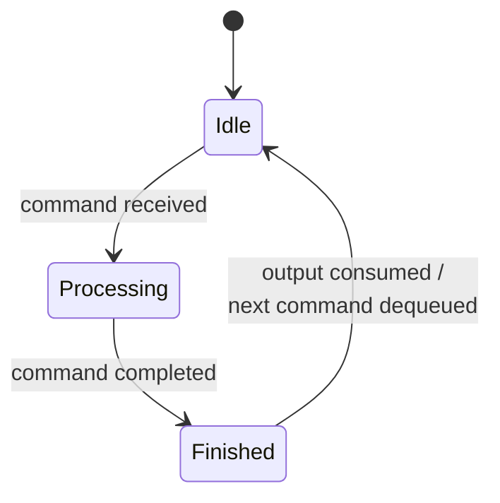

# Android Bridge

The Android Bridge communicates with Android devices over ADB (TCP). Each device is uniquely identified by its **IP address** - if two targets share the same IP, the bridge raises a `DuplicateTargetError` and attempts automatic resolution (see [Target Uniqueness](#target-uniqueness)).

:::note[Pre-registration required]
The Android Bridge only operates on devices whose IP is registered in the [Device Registry](device-registry) as an `android-camera`. Unregistered IPs discovered via mDNS are ignored. Device pairing is handled separately by the [mDNS Discovery pairing flow](mdns-discovery#pairing-mode).
:::

## State Machines

The Android Bridge manages **three state machines per device**.

### Target Machine

Tracks how the bridge knows a device's network address. Every state transition implies an ADB disconnect from the previous port before connecting to the new one.

| State | Representation | Description |
|---|---|---|
| **Unknown** | `ip` | IP known (e.g. from registry), no ADB connection |
| **Temporary** | `ip:anyPort` | Connected on a random mDNS-discovered port |
| **Persistent** | `ip:configuredPort` | Connected on the configured persistent port (e.g. `5555`) |

### Connection Machine

| State | Condition |
|---|---|
| **Disconnected** | No active ADB session |
| **Connecting** | ADB handshake in progress |
| **Connected** | ADB session active, device responsive |

### Command Machine

Serializes command execution so that multiple commands never run in parallel on the same device.

| State | Description |
|---|---|
| **Idle** | Ready to accept a new command |
| **Processing** | A command is currently executing |
| **Finished** | Command completed, output available for the caller |

Commands received while in **Processing** are enqueued and executed after **Finished -> Idle**.

## Target Uniqueness

Targets are unique by IP. If two targets with the same IP are detected (e.g. a temporary and a persistent entry coexisting), the bridge:

1. Pings both targets
2. Disconnects whichever does not respond
3. If both respond, disconnects the **temporary** one
4. If neither responds, transitions to **Unknown**

This avoids ghost connections and ensures a single active session per device.

## API

### Device Control

| Procedure | Description |
|---|---|
| `reboot(ip)` | Reboot the device |
| `wakeUp(ip)` | Wake the screen |
| `dismissKeyguard(ip)` | Dismiss the lockscreen |
| `inputTap(ip, x, y)` | Tap at screen coordinates |
| `openUrl(ip, url)` | Open a URL via intent |

### App Management

| Procedure | Description |
|---|---|
| `launchApp(ip, packageId)` | Launch an app |
| `restartApp(ip, packageId)` | Force-stop and relaunch an app |
| `getForegroundActivity(ip)` | Get the currently focused activity |
| `isActivityInForeground(ip, activity)` | Check if a specific activity is active |

### Wait

| Procedure | Description |
|---|---|
| `waitForDevice(ip)` | Wait until the device is online |
| `waitForDisconnect(ip)` | Wait until the device disconnects |

## Implementation: adb

The bridge spawns `adb` as a child process for every operation. The interface's device states are derived from ADB's raw states via pattern matching:

| Interface State | ADB States |
|---|---|
| **Connected** | `device` |
| **Offline** | `offline` - `recovery` - `rescue` - `sideload` - `bootloader` |
| **Disconnected** | `disconnect` - absent from `adb devices` |
| **Unknown** | any unrecognized value |
