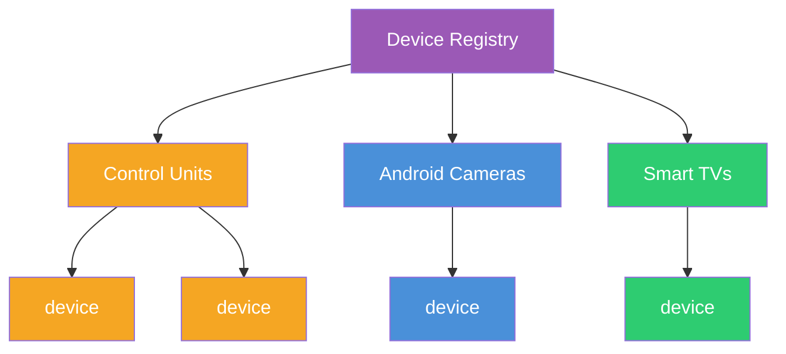
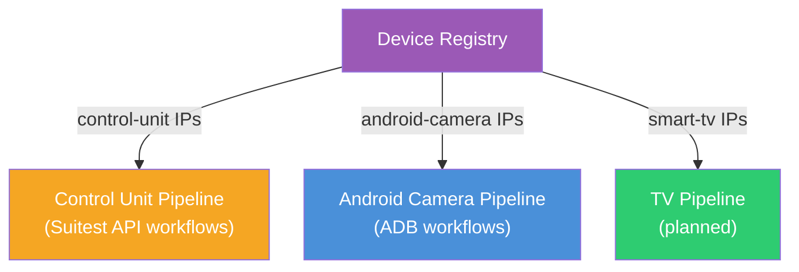

# Device Registry

The Device Registry is the central catalogue of all lab devices. It associates a **label** and an **IP address** to each device, grouped into three categories with distinct purposes.

## Device Categories

### Control Units

CandyBoxes and Raspberry Pis that manage groups of downstream devices. Each control unit **owns** one or more devices (TVs, set-top boxes, etc.).

Used for:
- **Bulk-offline heuristic** - when multiple devices owned by the same control unit go offline simultaneously, recovery targets the control unit itself rather than individual devices
- **Dashboard** - show control unit health and owned-device status

### Android Cameras

Android devices running the Suitest camera app. The lab network is large - the registry defines the **exact subset of IPs** the bridge should operate on, ignoring all other ADB-reachable devices.

Used for:
- **Automated recovery** - restart camera app, reboot device, verify stream availability
- **Scoped discovery** - only mDNS endpoints matching a registered IP are processed by the AndroidBridge

### Smart TVs

Lab TVs used for testing. Not actively managed by the current automation, but tracked for future use.

Used for:
- **Scheduled TV Recording Sessions** (planned) - power on, select input, record, power off

## Device Model

Each registry entry is intentionally minimal:

| Field | Type | Description |
|---|---|---|
| `label` | `string` | Human-readable name |
| `ip` | `string` | Static IP address |
| `category` | `control-unit` · `android-camera` · `smart-tv` | Device category |

## Role in the System

The service operates **in parallel** on control-unit devices and android-camera devices with separate workflows and automation policies. The registry is the single source of truth that feeds both pipelines:

## Implementation: Suitest

The registry is currently populated from the **Suitest Public API** (v4). Device and control-unit data is fetched, paginated automatically, and mapped to the minimal internal model.
