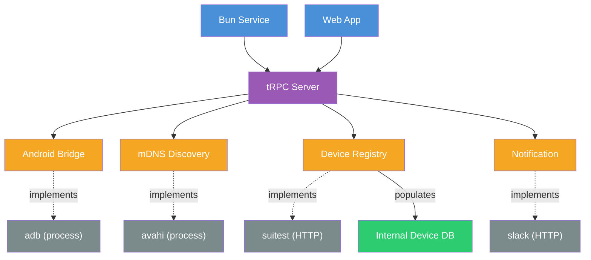

# Supervisor

| Interface | Implementsementation | Purpose |
|---|---|---|
| [**AndroidBridge**](android-bridge) | `adb` (process) | Communicate with Android devices |
| [**mDNS Discovery**](mdns-discovery) | `avahi` (process) | Discover devices on the local network |
| [**Device Registry**](device-registry) | `suitest` (HTTP) | Fetch registered lab devices, populate the internal Device DB |
| [**Notification**](notifications) | `slack` (HTTP) | Send alerts and status notifications |
