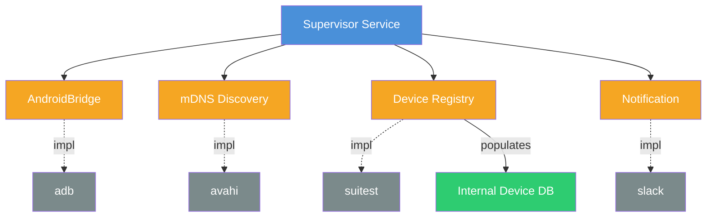

# Supervisor

## Dependency Graph

The service does not depend directly on external tools. Instead, it relies on generic interfaces that can be easily swapped out (e.g. for testing).

| Interface | Implementation | Purpose |
|---|---|---|
| **AndroidBridge** | `adb` | Communicate with Android devices |
| **mDNS Discovery** | `avahi` | Discover devices on the local network |
| **Device Registry** | `suitest` | Fetch registered lab devices, populate the internal Device DB |
| **Notification** | `slack` | Send alerts and status notifications |
