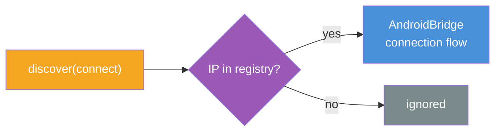
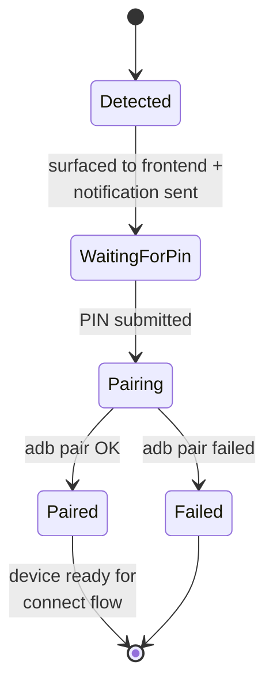
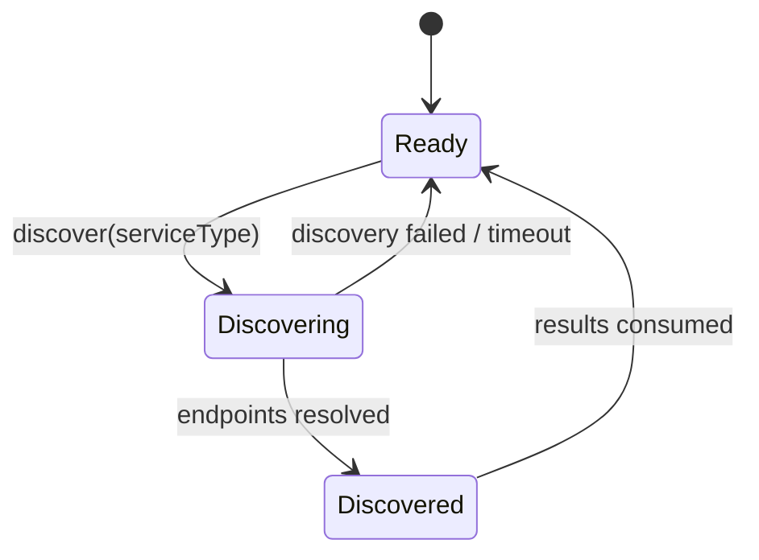

# mDNS Discovery

The mDNS Discovery interface detects devices advertising specific services on the local network. The caller triggers a discovery and receives a list of endpoints - without knowing which tool or protocol is used under the hood.


## Discovery Modes

The discovery service handles the two service types with **separate flows**:

### Connect Mode

When a `adb-tls-connect` endpoint is discovered and its IP matches a [registered device](device-registry), it is forwarded to the AndroidBridge for the standard connection flow (temporary -> persistent).



### Pairing Mode

When a `adb-tls-pairing` endpoint is discovered:

1. Endpoint is detected and a configurable action is triggered (e.g. notification)
2. The endpoint is surfaced to the **frontend** so the user can enter the pairing PIN
3. The PIN is sent back to complete `adb pair`
4. On success the device becomes eligible for the standard connect flow



| State | Description |
|---|---|
| **Detected** | Pairing endpoint found on the network |
| **WaitingForPin** | Endpoint shown in frontend, awaiting user input |
| **Pairing** | `adb pair` in progress with the submitted PIN |
| **Paired** | Pairing successful - device can now be connected |
| **Failed** | Pairing failed |


## Discovery Machine



| State | Description |
|---|---|
| **Ready** | Idle, waiting for a discovery request |
| **Discovering** | Scanning the network for the requested service type |
| **Discovered** | Scan complete, results available |

## Endpoint Model

| Field | Type | Description |
|---|---|---|
| `ip` | `string` | Device IP address |
| `port` | `number` | Advertised port |

## Service Types

| Preset | Service Type | Purpose |
|---|---|---|
| `adb-tls-connect` | `_adb-tls-connect._tcp` | Devices accepting ADB-TLS connections |
| `adb-tls-pairing` | `_adb-tls-pairing._tcp` | Devices in ADB pairing mode |

## Implementation: avahi

The current implementation runs `avahi-browse -prt` as a child process and parses its output.


### Output format

`avahi-browse -prt` outputs resolved lines in the format:

```
=;iface;protocol;name;type;domain;hostname;address;port;txt
```

The parser extracts `address` (field 7) and `port` (field 8) from lines starting with `=`, discarding duplicates.
