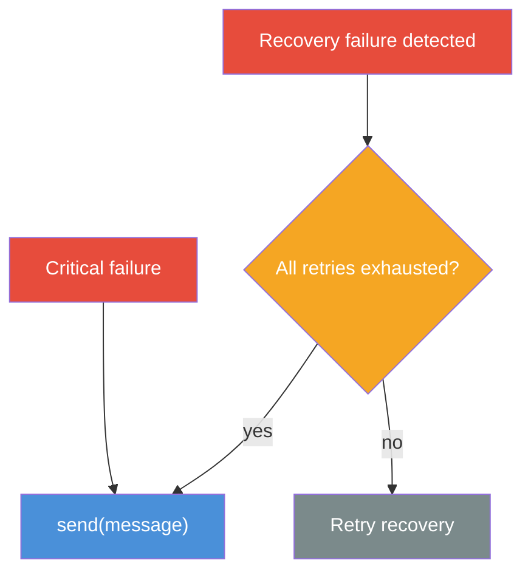
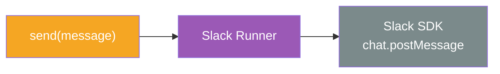

# Notifications

The Notification interface exposes a single method - `send(message)` - that the service and the web app use to deliver alerts. The caller does not know or care how the message is actually dispatched.

## Interface

| Method | Description |
|---|---|
| `send(message)` | Deliver a notification with the given payload |

### Message Model

| Field | Type | Description |
|---|---|---|
| `channel` | `string` | Destination channel |
| `text` | `string` | Plain-text content |
| `blocks` | `Block[]` | Optional rich-content blocks (`section` with `mrkdwn` or `plain_text`) |

## Notification Policy

Notifications are sent only in specific scenarios:

| Trigger | Description |
|---|---|
| **Retries exhausted** | Recovery workflow failed after all configured retry attempts |
| **Critical failure** | An immediately critical failure (configurable per device type) |

## Implementation: Slack

The current implementation wires `send(message)` to the **Slack Web API** (`chat.postMessage`). The tRPC server injects the Slack SDK as the concrete runner - the interface remains decoupled from any specific provider.

The runner authenticates with a **bot token** and posts to the configured Slack workspace. Response validation ensures that only `{ ok: true }` responses are accepted - any API-level error is surfaced as a typed `SlackAPIError`.
